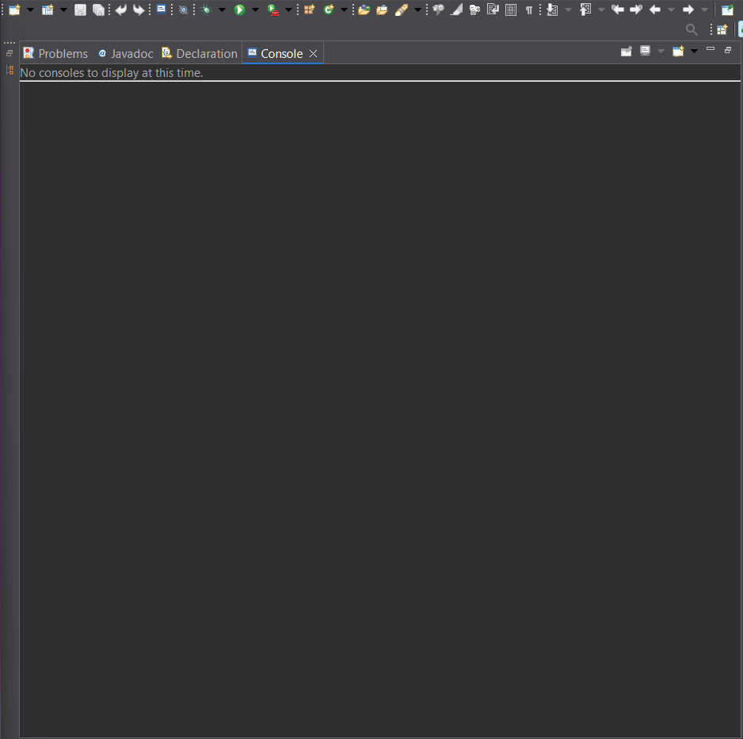

## Demo

1. Title: Mini-Nafmaxia

2. Description: A console-based Java application that simulates a simplified "Battleship" game on a 5×5 board. It randomly places 4 small "ships" (each occupying one cell) that the player tries to locate by firing shots with row and column coordinates.

3. Features

    • Dynamic creation of a 5×5 board

    • Random placement of 4 ships without overlap

    • Update with "hit" or "miss" for each shot

    • Indication of the number of ships in each row and column (hints)

    • Display of the board with symbols:
    
     • unread cell
   
     • missed shot
   
     • successful shot

5. Game Rules:
   1. Place 4 ships, each occupying one cell.
   2. The player inputs integers (1–5) for row and column.
   3. Each shot displays results ("hit"/"miss") and updates the board.
   4. Assistance is provided with the number of ships in the given row and column.
   5. Win when all 4 ships are sunk.

6. Prerequisites:

• Java 8 or newer

• (Optional) IDE like IntelliJ IDEA or Eclipse
